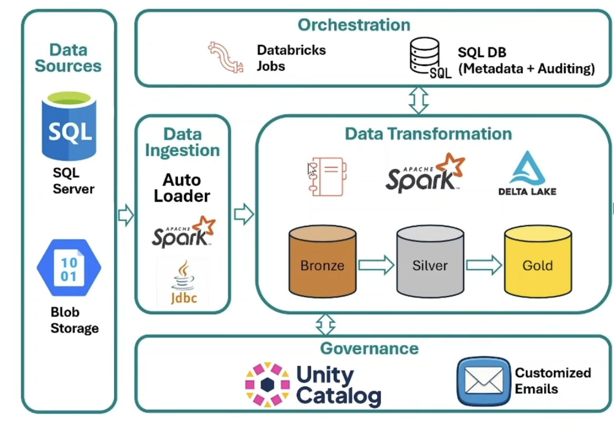

# Tulover Neobank

**A metadata-driven banking lakehouse built with Databricks, PySpark, SQL, and Delta Lake.**

Neobanks like REVOLUT produce large volume of data on a day-to-day basis. This project tulover (inspired from REVOLUT spelled backwards) brings the data together through a reusable ingestion framework and a Bronze → Silver → Gold medallion architecture, turning fragmented source data into customer, branch, payment, and risk analytics.

> **6 source datasets · 3 loading strategies

[Architecture](#architecture) · [Engineering highlights](#engineering-highlights) · [Analytics](#banking-data-products) · [Run the project](#run-the-project) · [Code map](#repository-map)

## The business problem

A banking team needs to connect money movement with customer relationships and credit exposure. Those answers span operational databases and external files, each with different update patterns.

Tulover builds the data foundation for questions such as:

- Which branches hold the most deposits and generate the most transaction activity?
- Which customers have high balances, active accounts, and external credit exposure?
- Which payment gateways and devices experience failures or slower processing?
- How do daily transactions compare with the bank’s current customer and account metrics?

The project demonstrates both sides of data engineering: moving data reliably through defined layers and modeling it around questions a business can actually ask.

## Architecture



**Execution environment:** Databricks notebooks with Spark, Delta Lake, `dbutils`, and a Unity Catalog namespace rooted at `banking`. The repository contains notebook source exports and sample data; workspace jobs and dashboard definitions are not included.

## Engineering highlights

### Configuration driving the pipeline

The same ingestion and Silver notebooks process multiple tables. Source details, keys, loading behavior, and execution order live in Delta metadata tables instead of separate pipelines for every dataset.

| Control table | Responsibility |
| --- | --- |
| `banking.metadata.tables` | Source locations, target schemas, active flags, and load order |
| `banking.metadata.table_parameters` | Per-table `load_type`, `primary_key`, and `watermark_column` |
| `banking.metadata.table_watermarks` | Last processed watermark used for incremental selection |
| `banking.metadata.pipeline_runs` | Run and table identifiers, timestamps, status, record counts, and errors |


### Loading strategies match the data

| Dataset | Source | Silver strategy | Key | Watermark |
| --- | --- | --- | --- | --- |
| `customers` | SQL Server | `MERGE` | `customer_id` | `updated_at` |
| `accounts` | SQL Server | `MERGE` | `account_id` | `updated_at` |
| `transactions` | SQL Server | `APPEND` | `txn_id` | `txn_timestamp` |
| `branches` | SQL Server | `FULL` | `branch_code` | — |
| `credit_bureau_reports` | CSV files | `MERGE` | `customer_id` | `bureau_pull_date` |
| `payment_gateway_logs` | CSV files | `APPEND` | `txn_id` | `processed_timestamp` |

- **FULL:** overwrite the Silver table with the selected Bronze data.
- **APPEND:** insert newly selected records into Silver.
- **MERGE:** use Delta Lake UPSERTS to update matching keys and insert new ones.

SQL ingestion applies a watermark predicate at the source for incremental loads. File ingestion uses <b>AUTO LOADER</b> with per-table schema and checkpoint locations. Bronze stores incoming records in append mode; Silver applies the configured load strategy.

### Progress is tracked after the Silver write

For watermark-based tables, the pipeline updates the stored maximum watermark after the Silver write succeeds. This keeps extraction progress tied to downstream processing. Silver also adds processing timestamps, and a shared `run_id` connects table results across the workflow.

The [notification notebook](email_notifications/email_notifications/email_notification.py) joins audit records with table metadata, builds an HTML execution summary, and sends it through Gmail SMTP using a credential retrieved from a Databricks secret scope.

### Gold transformations answer business questions

The [Gold driver](silver_to_gold/silver_to_gold/master_driver_src_to_gold.py) resolves transformation notebook paths from metadata, executes them, and records their returned row counts. <b>SQL models use CTEs, joins, aggregations, conditional metrics, and window functions to publish business-facing tables.<b>

## Banking data products

| Gold table | Grain | What it makes possible |
| --- | --- | --- |
| [`customer_360`](silver_to_gold/silver_to_gold/gold_transformations/customer_360.sql) | Customer | Combine account balances, transaction activity, branch details, latest credit information, and balance-based segments |
| [`branch_performance`](silver_to_gold/silver_to_gold/gold_transformations/branch_performance.sql) | Branch | Compare customer counts, accounts, deposits, and transaction volume |
| [`transaction_summary`](silver_to_gold/silver_to_gold/gold_transformations/transaction_summary.sql) | Transaction date × gateway × device | Analyze successful and failed payments alongside average processing time |
| [`tulover_daily_KPI`](silver_to_gold/silver_to_gold/gold_transformations/tulover_daily_KPI.sql) | Transaction date | View daily transaction metrics alongside current bank-wide customer, account, and credit aggregates |
| [`risk_customer_summary`](silver_to_gold/silver_to_gold/gold_transformations/risk_customer_summary.sql) | Risk grade | Summarize credit scores, external loan counts, and overdue amounts |


Interactive dashboards and a Genie natural-language interface are planned consumers of these Gold tables.

## Skills demonstrated

| Skill | Evidence in this project |
| --- | --- |
| **Lakehouse architecture** | Separate raw ingestion, load-managed tables, and analytical models using Delta Lake |
| **Python and PySpark** | Parameterized notebooks, JDBC reads, DataFrame transformations, and Delta merge operations |
| **Advanced SQL and data modeling** | Customer-level pre-aggregation, latest-report selection with `ROW_NUMBER`, and explicit analytical grains |
| **Incremental processing** | Source-side watermark filtering, file checkpoints, and post-Silver watermark updates |
| **Metadata framework design** | Separate table registration, extensible key-value parameters, progress tracking, and execution audit tables |
| **Orchestration building blocks** | Notebook widgets, task-value handoffs, configurable ordering, and a metadata-driven Gold dispatcher |
| **Operational observability** | Run-level correlation, table status, processing counts, error capture, and HTML notification summaries |
| **Platform integration** | SQL Server connectivity, Unity Catalog tables and volumes, and runtime secret retrieval |

## Sample data

The included fixtures provide **42,504 records across six datasets** for exploring the pipeline:

| Dataset | Records |
| --- | ---: |
| Branches | 4 |
| Customers | 4,000 |
| Accounts | 4,500 |
| Transactions | 15,000 |
| Credit bureau reports | 4,000 |
| Payment gateway logs | 15,000 |


## Run the project


Use a Databricks workspace with compute supporting Spark, Delta Lake, Unity Catalog, and Auto Loader. The notebooks require access to a SQL Server or Azure SQL database, the Microsoft SQL Server JDBC driver, and permission to create the `banking` catalog, schemas, and landing volume.

Import the `.py` and `.sql` files as Databricks notebooks, preserving the Gold driver’s relative `gold_transformations/` folder. These exports use notebook cells and Databricks utilities rather than a standalone Python entry point.


## Repository map

```text
tulover-neobank/
├── source_data/
│   ├── sql_server/                  # Source schema and banking seed data
│   └── blob/                        # Credit bureau and payment gateway CSVs
├── metadata_setup/
│   ├── setup_metadata.sql           # Control tables, volume, and registrations
│   └── check_metadata.sql           # Operational inspection queries
├── source_to_silver/
│   └── source_to_silver/
│       ├── read_table_list.py       # Active table discovery
│       ├── read_table_parameters.py # Per-table configuration
│       ├── source_to_bronze.py      # JDBC and Auto Loader ingestion
│       ├── bronze_to_silver.py      # FULL / APPEND / MERGE and watermarks
│       └── setup_secret_scope_dummy.py
├── silver_to_gold/
│   └── silver_to_gold/
│       ├── master_driver_src_to_gold.py
│       └── gold_transformations/    # Five analytical SQL notebooks
└── email_notifications/
    └── email_notifications/
        └── email_notification.py   # HTML audit summary via SMTP
```

## Current boundaries and next steps

The repository demonstrates an end-to-end lakehouse framework. Production hardening remains a useful extension of the project:

- **Replay and data quality:** add key deduplication, explicit CSV types, validation rules, and quarantine tables. Bronze currently appends every extraction, so repeated FULL loads can accumulate duplicates that flow into Silver; timestamp watermarks also need a policy for late or equal-timestamp records.
- **Failure handling:** explicitly wait for Auto Loader completion before Silver processing and re-raise ingestion errors after audit updates. The current Bronze exception handler logs failures without re-raising them.
- **Observability:** extend the combined source-to-Silver audit entry into separate layer metrics and capture actual insert/update counts. Current Silver counts represent selected input records.

- **Governance and consumption:** define access policies and PII masking, then add dashboards and Genie configuration for the Gold models.


